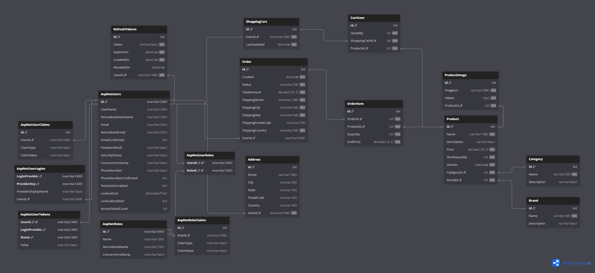

# 🛒 E-Commerce Backend API

A robust, production-ready RESTful API built with **.NET 9** using **Clean Architecture**. This backend powers an e-commerce platform with secure authentication, product catalog management, shopping cart functionality, and order processing.

## 🚀 Tech Stack

* **Framework:** .NET 9 (ASP.NET Core Web API)
* **Language:** C# 12
* **Database:** SQL Server (Entity Framework Core 9)
* **Authentication:** ASP.NET Core Identity + JWT (Access Tokens & Refresh Tokens)
* **Logging:** Serilog
* **Documentation:** Swagger / OpenAPI
* **Mapping:** AutoMapper
* **Architecture:** Clean Architecture (API, Business, Core, Data)

---

## ✨ Key Features

* **🔐 Advanced Security**
    * **JWT Authentication:** Short-lived Access Tokens (15 min).
    * **Refresh Tokens:** Long-lived, rotating tokens stored in **HttpOnly Cookies** (prevents XSS).
    * **Token Rotation:** Automatic theft detection (Revokes all tokens if a reused token is detected).
    * **Brute Force Protection:** Account lockout after 5 failed attempts.
    * **Rate Limiting:** Prevents bot spamming (60 requests/min).
    * **CORS:** Configured for secure frontend integration.
* **📦 Product Management:** CRUD operations for Products, Categories, Brands, and Product Images.
* **🛒 Shopping Cart:** Persistent user carts with real-time stock validation.
* **📦 Order System:** Order placement, status tracking, and history management.
* **👤 User Management:** Address book, Profile management, Role-based access (Admin/Customer).

---

## 🛠️ Getting Started

### Prerequisites
* [.NET 9 SDK](https://dotnet.microsoft.com/download/dotnet/9.0)
* [SQL Server](https://www.microsoft.com/en-us/sql-server/sql-server-downloads) (LocalDB or Express)
* Your favorite IDE (VS 2022, Rider, or VS Code)

### 1. Clone the Repository
```bash
git clone [https://github.com/yourusername/ecommerce-backend.git](https://github.com/yourusername/ecommerce-backend.git)
cd ecommerce-backend
```

### 2. Configuration
Update `ECommerce.API/appsettings.json` with your local connection string and secure JWT keys.

```json
{
  "ConnectionStrings": {
    "constr": "Server=.\\SQLEXPRESS;Database=EcommerceDb;Integrated Security=True;TrustServerCertificate=True;"
  },
  "Jwt": {
    "Issuer": "https://localhost:7069",
    "Audience": "https://localhost:7069",
    "SecretKey": "YOUR_SUPER_SECRET_KEY_MUST_BE_AT_LEAST_32_CHARS_LONG",
    "DurationInMinutes": 15
  },
  "AllowedHosts": "*"
}
```

### 3. Database Setup
## 🗄️ Database Schema


Apply migrations to create the database and seed initial data.

```bash
cd ECommerce.API
dotnet ef database update
```

### 4. Run the Application
```bash
dotnet run
```
The API will start at `https://localhost:7069`.
Open your browser to `https://localhost:7069/swagger` to explore the endpoints.

---

## 👩‍💻 For Frontend Developers (Angular Integration)

This backend uses a **secure "cookie-based" authentication flow** for the Refresh Token to prevent XSS attacks.

### 1. Base Configuration
* **API URL:** `https://localhost:7069/api`
* **CORS:** Configured to accept requests from `http://localhost:4200` (Angular Default).

### 2. Authentication Flow (Important!)
* **Login:**
    * Send `POST /api/auth/login` with `{ identifier, password }`.
    * **Response:** You will receive the `accessToken` in the JSON body.
    * **Cookie:** The `refreshToken` is set automatically in an **HttpOnly cookie**. **You cannot see this cookie in JavaScript, but the browser handles it automatically.**
* **Requests:**
    * Attach the `accessToken` to the **Authorization Header** for every secure request:
        ```javascript
        Authorization: Bearer <your_access_token>
        ```
* **Refreshing Tokens (Session Extension):**
    * When you get a `401 Unauthorized`, call `POST /api/auth/refresh-token`.
    * **Crucial:** You must set `{ withCredentials: true }` in your HTTP client request so the browser sends the hidden cookie.
    * The server will return a new `accessToken` and rotate the cookie automatically.

---

## 👤 Default Users (Seed Data)

The database is automatically seeded with an Admin account on the first run.

| Role | Email | Password |
| :--- | :--- | :--- |
| **Admin** | `admin@myapp.com` | `Admin@123` |
| **User** | *(Register via API)* | *(Your choice)* |

---

## 📂 Project Structure (Clean Architecture)

* **`ECommerce.API`**: The entry point. Controllers, Middleware, DTOs.
* **`ECommerce.Business`**: Business logic, Services, Validation, AutoMapper Profiles.
* **`ECommerce.Core`**: Domain Entities, Interfaces, Enums, Custom Exceptions.
* **`ECommerce.Data`**: DbContext, EF Core Configurations, Migrations, Seeders.

---

## 🤝 Contributing

1.  Create a feature branch (`git checkout -b feature/AmazingFeature`).
2.  Commit your changes (`git commit -m 'Add some AmazingFeature'`).
3.  Push to the branch (`git push origin feature/AmazingFeature`).
4.  Open a Pull Request.
